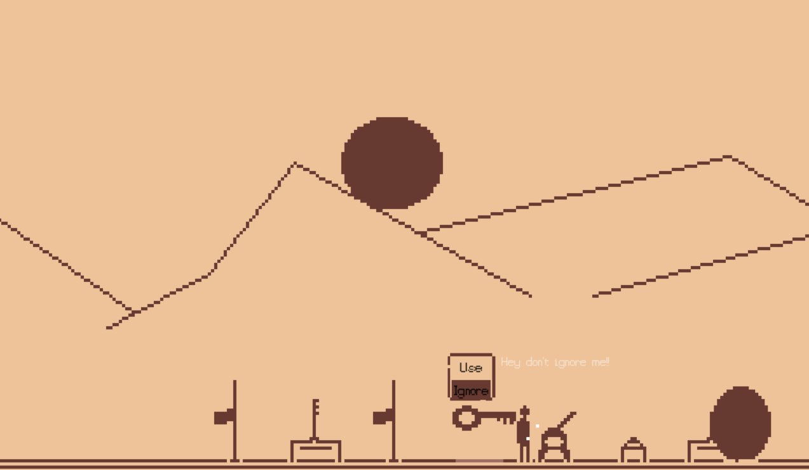
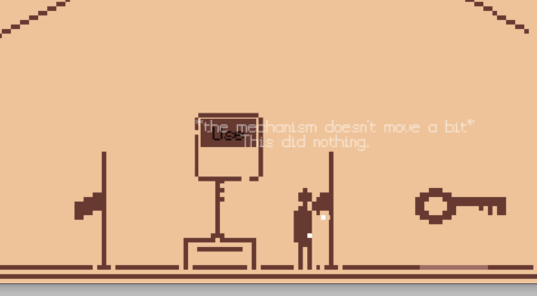
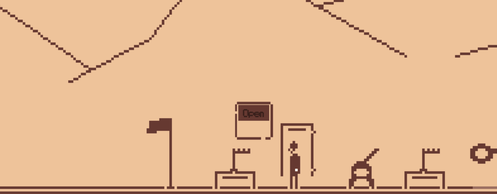

# 1Bit-PPG

Simple game created in Godot Engine utilizing [gdppg](https://github.com/dAmihl/gdppg) and [ppg-core](https://github.com/dAmihl/ppg-core)

Please refer to Godots documentation on how to build Godot Engine with custom modules to run this game.

### What it does:

It's a simple 2d sidescrolling "puzzle" game, where a predefined YAML (from the _/universes_ folder) is plugged into the _ppg_ module and generates a _"puzzle"_. This puzzle is then displayed (__very simply__) in the map. The player is able to interact with the game objects until the portal opens. When entering the portal, a new room, i.e. puzzle, is generated.

Simple Generated World:

The interpretation of the generated puzzle is very simple. Every relevant object is parsed and spawned on the ground in random order.

When interacting with an object, the event is sent to the PPG engine, handled, and a callback event is then sent back to GDscript where the text is displayed. In this case, the Interaction with the object did nothing (i.e. did not advance) to the puzzle's state.

Here is a little gameplay clip:

